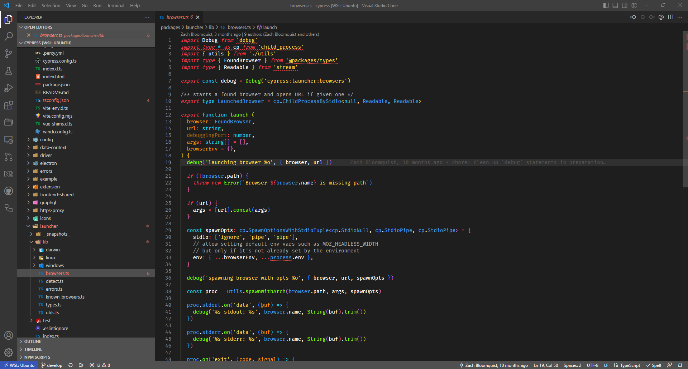

# Monokai Dimmed+Vibrant

Test it out on the [Theme Tester Playground](https://vscode.dev/theme/alexravenna.monokai-dimmed-vibrant/) or see previews for multiple programming languages on [VS Code Themes](https://vscodethemes.com/e/alexravenna.monokai-dimmed-vibrant/monokai-dimmedvibrant).

A dark color theme based on the gray-tone editor colors of the built-in Monokai Dimmed theme and the vibrant text colors of [Monokai Vibrant](https://marketplace.visualstudio.com/items?itemName=s3gf4ult.monokai-vibrant).

**Enjoy!**

## Tech Stack
alexravenna/vscode-dimmed-vibrant is built on the following main stack:

-  [JavaScript](https://developer.mozilla.org/en-US/docs/Web/JavaScript) – Languages
-  [GitHub Actions](https://github.com/features/actions) – Continuous Integration
-  [Shell](https://en.wikipedia.org/wiki/Shell_script) – Shells

Full tech stack [here](/techstack.md)
