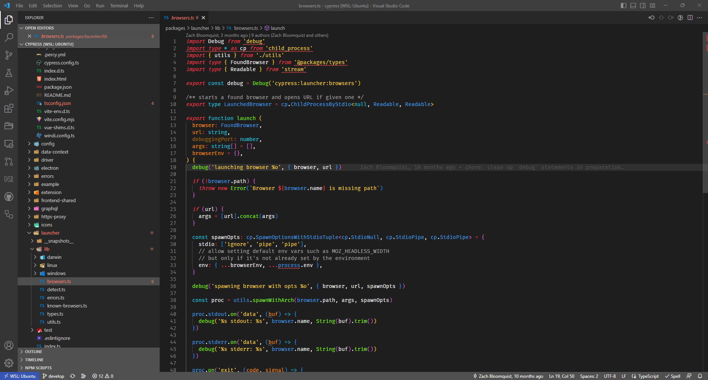

# Dimmed+Vibrant

Test it out on the [Theme Tester Playground](https://vscode.dev/theme/alexravenna.monokai-dimmed-vibrant/)
or see previews for multiple programming languages on [VS Code Themes](https://vscodethemes.com/e/alexravenna.monokai-dimmed-vibrant/monokai-dimmedvibrant).

A dark color theme based on the gray-tone editor colors of the built-in Monokai
Dimmed theme and the vibrant text colors of [Monokai Vibrant](https://marketplace.visualstudio.com/items?itemName=s3gf4ult.monokai-vibrant).

**Enjoy!**
